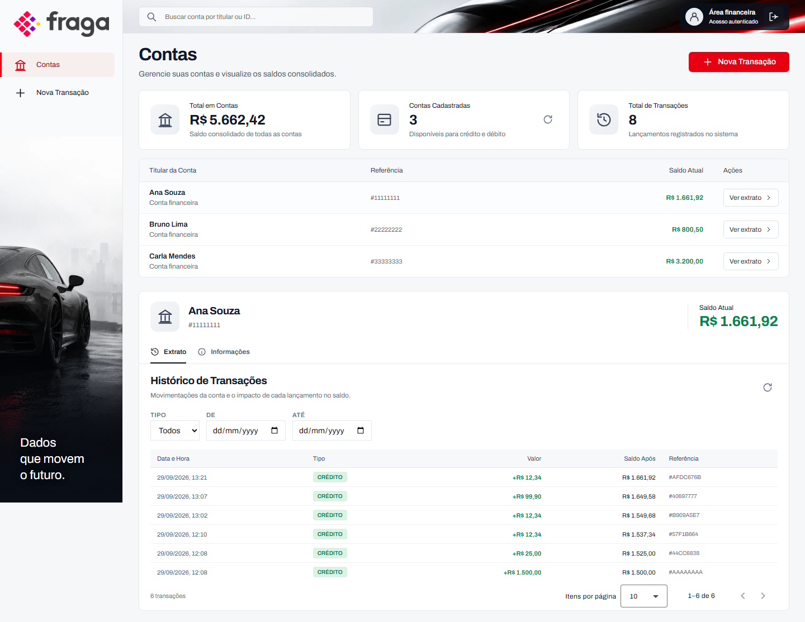
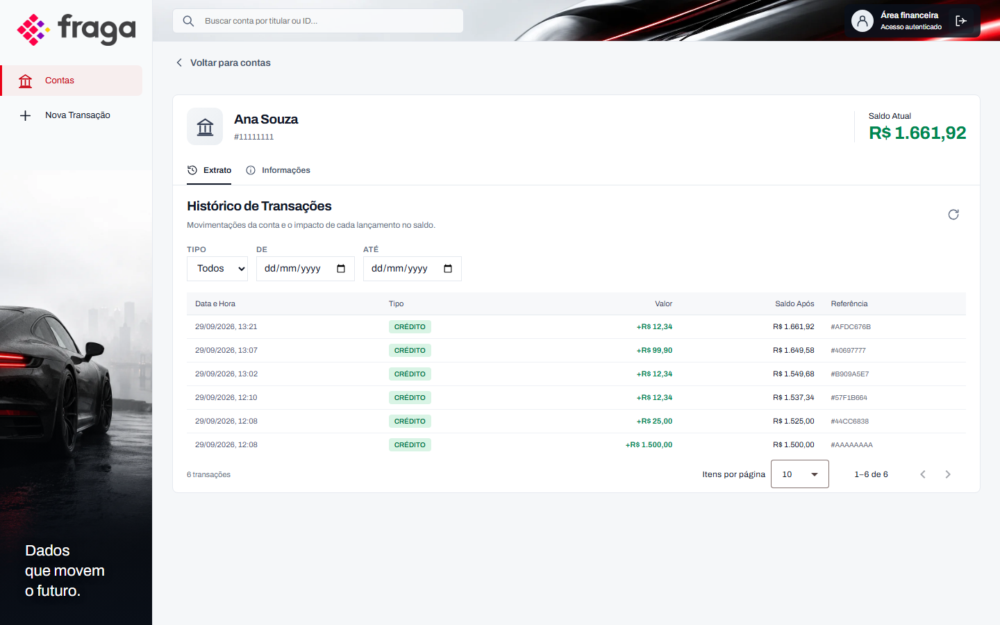
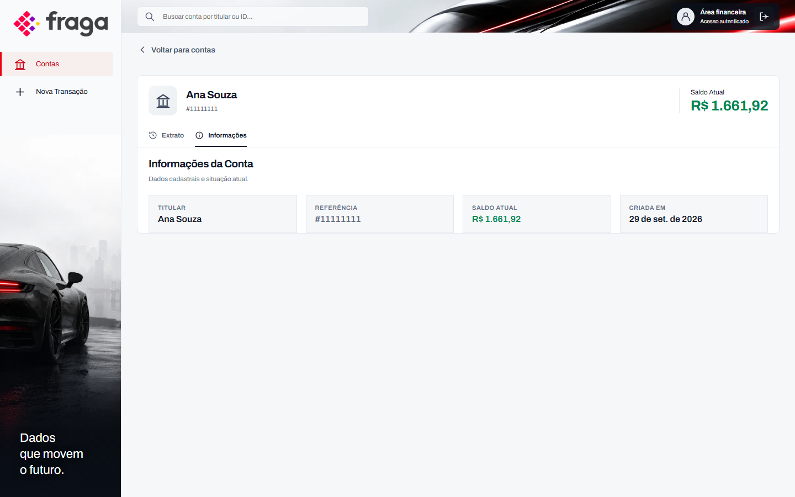
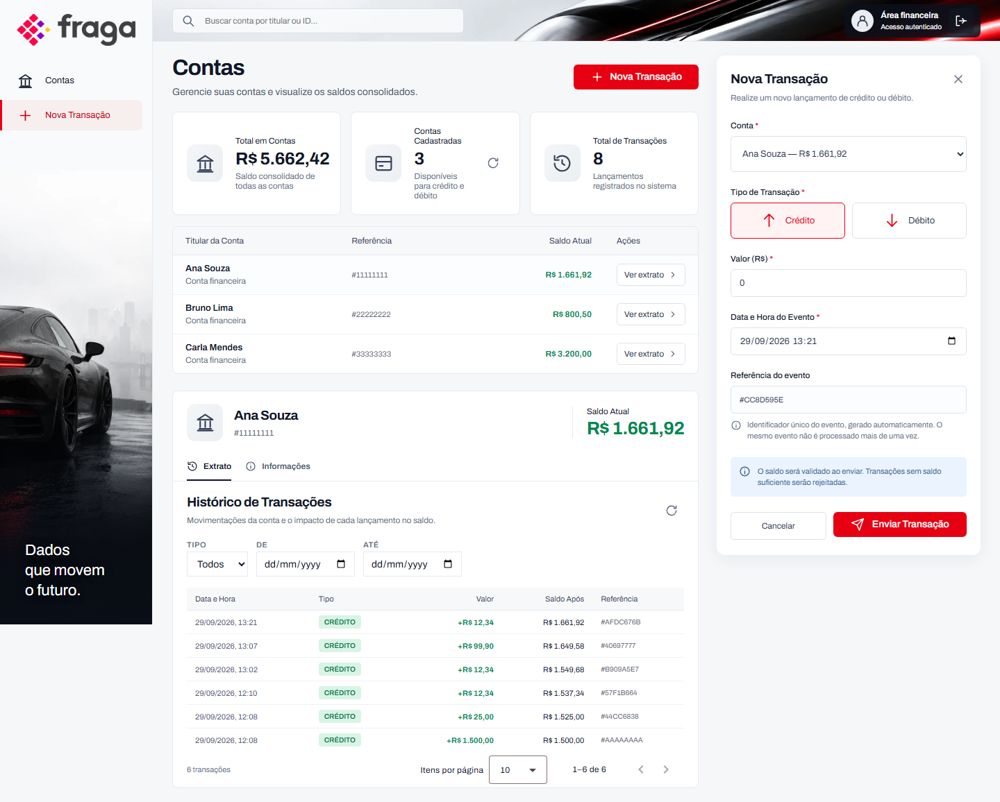
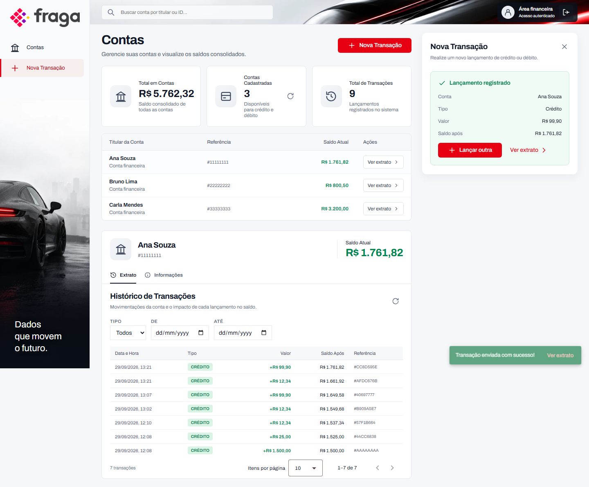
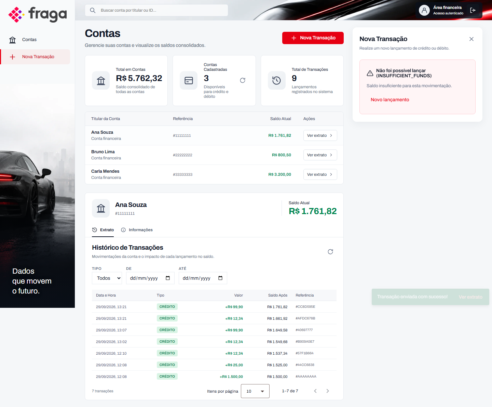

# FRAGA · Financeiro

Plataforma de transações financeiras: uma **API em .NET** recebe créditos e débitos, um **worker**
processa os eventos em segundo plano e uma **aplicação Angular** permite consultar contas, extratos
e o resultado de cada lançamento.

O foco não é só "funcionar": as **quatro regras de negócio** do desafio — idempotência, consistência,
transacionalidade e integridade ponta a ponta — são garantidas em profundidade (domínio, aplicação e
banco) e cada uma tem teste.

> **Demonstração não oficial.** O visual é inspirado na identidade da Fraga Inteligência Automotiva,
> usada aqui apenas como referência estética para um projeto de avaliação técnica. Não há vínculo
> institucional, os dados são fictícios e nenhuma operação financeira real acontece.

---

## Telas

| Contas (lista, resumo e extrato) | Extrato da conta (tela própria, com filtros) |
|---|---|
|  |  |

| Informações da conta | Nova transação (painel lateral) |
|---|---|
|  |  |

| Feedback de sucesso | Feedback de saldo insuficiente |
|---|---|
|  |  |

> Os prints são gerados pelo próprio projeto, com `npm run prints` (Playwright), a partir da aplicação
> em execução — assim nunca ficam desatualizados.

---

## Como rodar

Pré-requisito: **Docker** com Compose. Nada mais.

```bash
docker compose up --build
```

Abra **http://localhost:4200** e entre com **`operador` / `operador123`**.

| Serviço | Endereço | Observação |
|---|---|---|
| Aplicação web | http://localhost:4200 | o nginx serve o Angular e encaminha `/api` à API |
| API + Swagger | http://localhost:8080/swagger | documentação interativa, com exemplos prontos |
| Keycloak | http://localhost:8081 | admin / admin |
| RabbitMQ | http://localhost:15672 | guest / guest |
| PostgreSQL | localhost:5433 | postgres / postgres |

Para encerrar: `docker compose down`. Para apagar os dados de demonstração: `docker compose down -v`.

> Observabilidade opcional (logs indexados no Elasticsearch):
> `ELASTICSEARCH_URI=http://elasticsearch:9200 docker compose --profile observability up`

---

## O que o sistema faz

- **Lista de contas** com saldo consolidado e um resumo (total em contas, contas cadastradas e total de
  lançamentos).
- **Extrato da conta** em tela própria, paginado, com **filtros por tipo e período** e uma coluna que
  mostra o **saldo após cada lançamento**.
- **Lançamento de crédito ou débito** com validação de campos e feedback claro de **processamento,
  sucesso, duplicidade e saldo insuficiente** (painel na tela e aviso no canto).
- **Estados de interface**: carregamento (esqueleto), erro com "tentar de novo", lista vazia e sessão
  expirada (que leva de volta ao login).
- **Segurança**: acesso autenticado via Keycloak (OIDC, Authorization Code + PKCE).

## As quatro regras de negócio

| Regra | Como é garantida |
|---|---|
| **Idempotência** | Índice único em `transactions.event_id`. Repetir o mesmo evento devolve o resultado anterior e o saldo **não** muda — inclusive quando a fila reentrega a mensagem |
| **Consistência** | Invariante no agregado `Account` (saldo nunca negativo) e `CHECK balance >= 0` no banco |
| **Transacionalidade** | Saldo e lançamento gravados na **mesma transação**; ou tudo grava, ou nada |
| **Integridade ponta a ponta** | O backend é a fonte da verdade; o frontend reflete o estado e traduz os erros de negócio |

Concorrência: ao debitar, a conta é bloqueada com `SELECT ... FOR UPDATE`, impedindo que duas
operações gastem o mesmo saldo. Há teste de integração com débitos simultâneos.

---

## Arquitetura

Clean Architecture com DDD tático. As dependências apontam para dentro:
`Api → Infrastructure → Application → Domain`.

| Camada | Responsabilidade |
|---|---|
| `FinancialTransactions.Domain` | `Account`, `Transaction`, `Money` e as regras de saldo |
| `FinancialTransactions.Application` | Casos de uso e interfaces de persistência, cache e fila |
| `FinancialTransactions.Infrastructure` | EF Core, PostgreSQL, Redis, RabbitMQ e cache |
| `FinancialTransactions.Api` | Contratos HTTP, autenticação, Swagger, health checks e DI |
| `FinancialTransactions.Worker` | Consome a fila e atualiza os saldos |
| `frontend` | Angular + NgRx: contas, extrato e lançamentos |

**Fluxo de um lançamento (síncrono, como o enunciado pede):**

```
POST /api/transactions
   └─ valida o payload, bloqueia a conta (FOR UPDATE) e grava saldo + histórico
      na mesma transação                                                    ──►  201 (novo)
                                                                                  200 (evento já processado)
                                                                                  422 (saldo insuficiente)
                                                                                  404 (conta inexistente)
```

**Diferencial — processamento assíncrono (RabbitMQ):** o mesmo evento pode ser enviado para
`POST /api/transactions/async`. A API grava como `PENDING`, publica na fila e responde `202`; um
**worker separado** atualiza o saldo e o resultado é consultado em `GET /api/transactions/{eventId}`
(`PROCESSED` ou `REJECTED`).

---

## API

| Método e rota | Resultado |
|---|---|
| `GET /api/accounts` | Contas com saldo consolidado |
| `GET /api/accounts/summary` | Resumo: contas, saldo total e lançamentos |
| `GET /api/accounts/{id}/transactions?page=&pageSize=&type=&from=&to=` | Extrato paginado, com filtros |
| `POST /api/transactions` | Processa o evento e atualiza o saldo (201 / 200 / 422 / 404) |
| `POST /api/transactions/async` | Diferencial: enfileira para o worker (202) |
| `GET /api/transactions/{eventId}` | Status de um evento enfileirado |
| `GET /health` · `GET /health/ready` | Liveness e readiness |

O **Swagger** em http://localhost:8080/swagger traz o contrato completo, com exemplos prontos para
testar, e os erros de negócio voltam como `ProblemDetails` com um `code`
(`INSUFFICIENT_FUNDS`, `DUPLICATE_EVENT`), que o frontend traduz em mensagem.

## Stack e diferenciais

| Requisito da vaga / desafio | Onde aparece |
|---|---|
| C#/.NET + APIs REST | ASP.NET Core, casos de uso, ProblemDetails e Swagger documentado |
| Angular + TypeScript + RxJS | Componentes standalone, serviços tipados e roteamento |
| **NgRx** | Contas, extrato e formulário como fatias de estado (actions, reducers, effects, selectors) |
| EF Core + PostgreSQL | Mapeamentos, migrations, índices e `FOR UPDATE` |
| Clean Architecture / DDD | Camadas com dependências para dentro e agregado protegendo invariantes |
| Docker | Um `docker compose up` sobe frontend, API, worker, banco, cache, fila e identidade |
| **Redis** | Cache com invalidação por versão e limite de requisições (30/10s) |
| **RabbitMQ** | Processamento assíncrono do saldo por um worker separado (endpoint `/async`) |
| **Keycloak (OIDC/OAuth2)** | Login com PKCE no frontend e validação de JWT na API |
| **Observabilidade** | Logs estruturados (Serilog) e health checks de liveness e readiness |

## Testes

```bash
dotnet test backend/FinancialTransactions.slnx   # 54 no backend
cd frontend
npm test -- --watch=false                        # 40 no frontend
npm run e2e                                      # 6 ponta a ponta (Playwright)
```

**100 testes** no total. Os de integração sobem **PostgreSQL e RabbitMQ reais** (Testcontainers) e
cobrem os cenários críticos: saldo insuficiente, evento duplicado e débitos concorrentes. Os testes
ponta a ponta percorrem login → contas → extrato com filtros → aba de informações → lançamento com
sucesso → rejeição por saldo insuficiente. Os testes e2e precisam da aplicação no ar
(`docker compose up`).

---

## Decisões e trade-offs

- **Síncrono por padrão:** o lançamento grava saldo e histórico na mesma transação e responde na hora —
  é o fluxo que o enunciado pede, e dá o feedback imediato de sucesso, duplicidade e saldo insuficiente.
  Como **diferencial**, o mesmo evento pode ser enfileirado (`/async`): desacopla e dá vazão, ao custo de
  consistência eventual e de expor o estado `PENDING`. O worker também reprocessa eventos pendentes
  antigos, cobrindo falhas de publicação.
- **Cache com invalidação por versão:** cada extrato é cacheado sob uma versão da conta; ao lançar, a
  versão muda e as entradas antigas expiram sozinhas — sem varrer chaves nem servir dado velho.
- **Autenticação por configuração:** com o Keycloak presente, todas as rotas exigem usuário
  autenticado (os health checks ficam públicos); sem ele, o ambiente abre para desenvolvimento e
  testes.
- **Moeda como Value Object:** `Money` é imutável, nunca negativo e sempre com 2 casas (arredondamento
  bancário), evitando erros de arredondamento.
- **Testes de frontend em Vitest:** o Angular 22 usa Vitest como runner padrão (o Karma foi
  depreciado). O enunciado cita Jasmine/Karma ou Jest; mantivemos o padrão do Angular.
- **Referências curtas:** os identificadores aparecem como `#57F1B664`, legíveis para quem usa a tela;
  o valor completo fica no `title` (hover), para suporte.
- **Segredos:** as credenciais do Compose servem apenas para desenvolvimento local. Em produção seriam
  necessários segredos externos, TLS e configuração de produção do Keycloak.

## Estrutura do repositório

```
backend/
├─ src/
│  ├─ FinancialTransactions.Domain          regras de negócio, sem dependências
│  ├─ FinancialTransactions.Application      casos de uso, DTOs e abstrações
│  ├─ FinancialTransactions.Infrastructure   EF Core, repositórios, cache e fila
│  ├─ FinancialTransactions.Api              HTTP, Swagger, health checks e DI
│  └─ FinancialTransactions.Worker           consumidor da fila
└─ tests/
   ├─ FinancialTransactions.UnitTests        domínio e casos de uso
   └─ FinancialTransactions.IntegrationTests API com PostgreSQL e RabbitMQ reais
frontend/
├─ e2e/         testes ponta a ponta (Playwright)
├─ scripts/     geração dos prints do README
└─ src/app/     core, shared e features (contas, extrato e transações)
infra/keycloak/ realm versionado (clients, role e usuário de demonstração)
docs/prints/    imagens usadas neste README
```

## Próximos passos

- Exportar o extrato em CSV e busca com atalho de teclado (`Ctrl K`).
- Escalar o worker de forma independente da API em produção.
